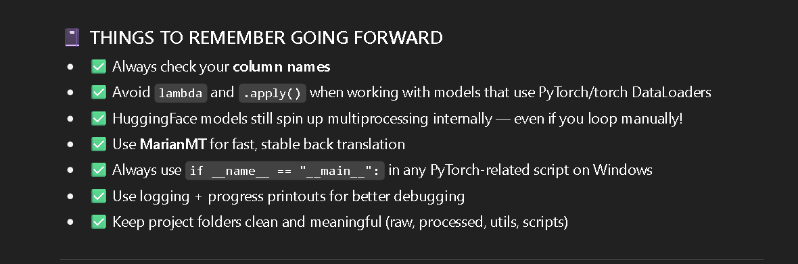

## workflow
1-> Load Raw Csv from Data/Raw_X and set the paths for the main data 
2-> Initialize a stable back-translation model we used Marian MT (before this we were using Facebook WMT19)
3-> Manually loop over sentences
4-> Augment each using model.augment [aug.augment(sentence)]
5-> Store in a new list
6-> Add to dataframe as new column
7-> Save to Processed_X folder

## Here are some mistakes which i made ...(i am learning it from chatgpt ... )

