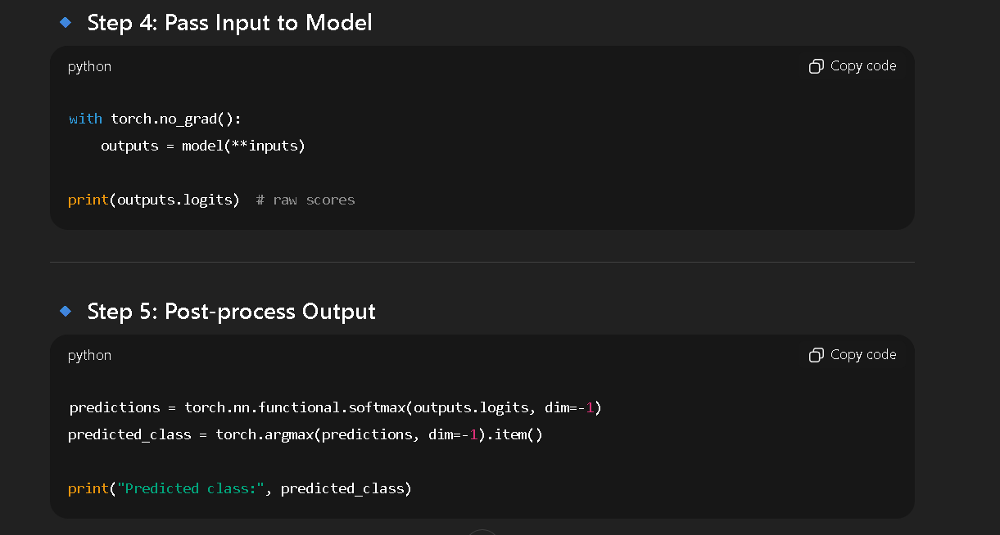

# Important notes
 
 ## function for removing HTML tags 

    import re  
    def remove_html_tags(text): 
        pattern = re.compile(r'<.*?>')  
    
        return pattern.sub(r'', text)

    

## function for removing punctuation

    def remove_punc(text):
    for char in exclude:
        text = text.replace(char, '')
        return text

## Tokenization from spacy 
    import spacy # Load small English model
    nlp = spacy.load("en_core_web_sm") 
    text = "Elon Musk founded SpaceX in 2002."
    doc = nlp(text)
    sentences = [sent.text for sent in doc.sents]
    print("Sentences:", sentences)

    words = [token.text for token in doc]
    print("Words:", words)

## Problems faced (Transformers-Hugging Face)

## Transformers Structure for any llm/nlp project

  

